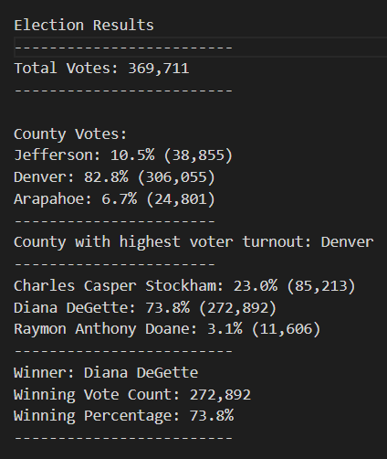

# Election_Analysis

## Overview of election audit
The purpose of this project was to provide an election audit of a US congressional precinct in Colorado.  This project determines total votes cast, total votes for each candidate, percentage of votes per candidate, and the winner of the election.

This project also reviews the voter turnout per county and determines which county provided the highest turnout of voters.

## Election audit results
The following list summarizes the results of the election audit:

* Number of votes cast in this congressional election
    * 369,711
* Number of votes and percentage of total votes for each county in the precinct
    * Jefferson: 38,855 (10.5%)
    * Denver: 306,055 (82.8%)
    * Arapahoe: 24,801 (6.7%)
* County with the largest number of votes
    * Denver
* Breakdown of the number of votes and percentage of total votes each candidate received
    * Charles Casper Stockham: 38,855 (10.5%)
    * Diana Degette: 272,892 (73.8%)
    * Raymon Anthony Doane: 11,606 (3.1%)
* Election winner, vote count, and percentage of total votes
    * Diana Degette: 272,892 (73.8%)

## Election audit summary
This script could be modified for different congressional districts or elections at various levels by adjusting variables to the given input.  With a few modifications we could also determine which candidate each county leaned toward in the election.  And with additional data, it could also be used to examine trends in voter turnout over time on a county by county basis.  